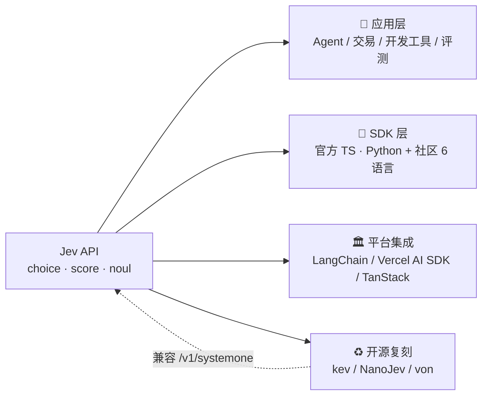

<div align="center">

# Awesome Jev Apps

**Jev（TypeSafe AI「System One」决策模型）优质应用与生态精选 · 持续更新**

[](LICENSE)
[](https://docs.typesafe.ai)
[](https://news.ycombinator.com/item?id=49717558)
[](#收录标准与投稿)
[](#局限与说明)
[](https://github.com/JingHao-Leon/awesome-jev-apps/actions/workflows/ci.yml)

</div>

**Jev** 是 TypeSafe AI 于 2026 年 9 月 15 日发布的首个 **System One 决策模型**（System One decision model）：它不像传统大语言模型那样逐字生成文本，而是对预先定义好的问题返回**带校准概率的类型化答案**——一次调用并行完成分类、路由、打分与是非判断。本仓库持续精选 Jev 发布以来生态中涌现的**优质开源应用、SDK、平台集成、开源复刻与深度教程**，帮工程师最快找到「把 Jev 用起来」的参考实现。

> English: A curated, quality-first list of apps, SDKs, integrations, open replicas, and guides built with **Jev**, the first "System One" decision model by TypeSafe AI — typed, calibrated answers instead of generated text. 70–500 ms latency, $0.042 per million input tokens, output free.

当前收录 **68** 条资源（[优质开源应用](#优质开源应用) **20** · [SDK 与集成](#sdk-与集成) **20** · [官方资源](#官方资源) **6** · [教程与评测](#深度教程与评测) **15** · [社区讨论](#社区讨论) **7**），条目数据同步维护在 [`data/projects.json`](data/projects.json)，由 [`scripts/check.py`](scripts/check.py) 做一致性校验。

<table>
  <tr>
    <td align="center">🚀<br><b><a href="#优质开源应用">优质开源应用</a></b><br>Agent · 交易 · 开发工具</td>
    <td align="center">🔌<br><b><a href="#sdk-与集成">SDK 与集成</a></b><br>官方 · 平台 · 社区 · 复刻</td>
    <td align="center">🏛️<br><b><a href="#官方资源">官方资源</a></b><br>文档 · 控制台 · 评测</td>
    <td align="center">📝<br><b><a href="#深度教程与评测">教程与评测</a></b><br>实操 · 架构 · 批判分析</td>
    <td align="center">💬<br><b><a href="#社区讨论">社区讨论</a></b><br>HN · daily.dev</td>
  </tr>
</table>

## 目录

- [Jev 是什么（60 秒版）](#jev-是什么60-秒版)
- [30 秒上手](#30-秒上手)
- [优质开源应用](#优质开源应用)
- [SDK 与集成](#sdk-与集成)
- [官方资源](#官方资源)
- [深度教程与评测](#深度教程与评测)
- [社区讨论](#社区讨论)
- [FAQ](#faq)
- [收录标准与投稿](#收录标准与投稿)
- [局限与说明](#局限与说明)

## Jev 是什么（60 秒版）

| 维度 | 传统生成式 LLM | Jev（System One） |
| --- | --- | --- |
| 输出 | 自由文本（需解析校验） | 预定义类型化答案 + 概率 + 置信度 |
| 提问原语 | — | **choice**（≤255 选项）· **score**（2–10 级刻度）· **noul**（0–1 是否概率） |
| 端到端延迟 | 3–329 秒 | **70–500 毫秒** |
| 定价 | 输出价约为输入 5 倍 | **输入 $0.042 / 百万 token，输出免费** |
| 擅长 | 写作、生成、复杂推理 | 分类、路由、打分、是非判断（"会思考的智能 if 语句"） |

- 官方声称在 System One 类任务上比参照前沿模型**快 193.6 倍、便宜 444.6 倍**（自建 workflow evals，批判性分析见 [TrueFoundry](https://www.truefoundry.com/blog/typesafe-ai-jev)）
- 创始人 Diogo Almeida 是 OpenAI 前研究员、RLHF / InstructGPT 联合发明人；公司种子轮 $40M（DCVC 领投）
- 已知局限：不会算术 / 计数 / 日期比较，不能生成文本，不支持图片与音频；"零幻觉"指**不可能返回 schema 之外的值**，不等于"永远正确"

生态全景（一张图看懂本清单怎么组织）：



## 30 秒上手

```bash
npm install @typesafe-ai/sdk
```

```js
import { choice, score, noul, TypeSafeClient } from "@typesafe-ai/sdk";

const client = new TypeSafeClient(); // 默认模型 jev-latest

const r = await client.systemOne({
  state: { ticket: "被重复扣款，要求退款", order: { id: "A-104", charges: [49, 49] } },
  questions: {
    department: choice("哪个团队处理", { billing: "支付/订阅问题", technical: "故障/集成", other: "其他" }),
    urgency:    score("紧急程度", ["低", "中", "高"]),
    refund:     noul("是否应退款"),
  },
});
// 一次请求并行返回全部答案，每个都带概率与置信度，可按置信度分流人工
```

## 优质开源应用

> ★ 数为 2026-09-23 快照，随时间变化。

### Agent 与自动化

- [**browser-use/jev-ultrafast**](https://github.com/browser-use/jev-ultrafast) — "i. am. speed."：Jev 负责选动作、只在需要打字时才唤醒 LLM 的浏览器 agent，Google Flights 实操演示 7.1 秒（`Python`，17.7k★）
- [**trycua/cua**](https://github.com/trycua/cua) — 开源计算机操作 agent 框架，内置 CUA-S1：计算机操作决策专用小型模型（26k★）
- [**imanshu03/jev-browser-use**](https://github.com/imanshu03/jev-browser-use) — 基于 Jev + CDP/Chromium 的轻量浏览器自动化（`Python`）

### 交易与金融

- [**OpenByteInc/QuantDinger**](https://github.com/OpenByteInc/QuantDinger) — 开源 AI 交易操作系统，集成 Jev System One：策略研究、回测、模拟/实盘，可搭多租户交易 SaaS（`Python`，12k★）
- [**jarrodwatts/jev-trader**](https://github.com/jarrodwatts/jev-trader) — 每个 Monad 区块做一次 Jev 交易决策（Kuru MON-USDC）（`TypeScript`，2k★）
- [**SaratAngajalaoffl/jeeva**](https://github.com/SaratAngajalaoffl/jeeva) — 基于 Jev 的中频交易框架（`TypeScript`）

### 开发者工具

- [**tamaratran/fast-jev-compaction**](https://github.com/tamaratran/fast-jev-compaction) — Claude Code 插件：一次 Jev 请求给全部工具调用打分并压缩上下文，保留内容逐字不动（`TypeScript`，6.2k★）
- [**devagrawal09/jev-review**](https://github.com/devagrawal09/jev-review) — 分阶段代码审查工作流 + 本地仪表盘（`TypeScript`，536★）
- [**dabit3/jev-experiments**](https://github.com/dabit3/jev-experiments) — 延迟敏感场景的 Jev demo 合集（`TypeScript`，365★）
- [**nozomi-koborinai/jev-spec**](https://github.com/nozomi-koborinai/jev-spec) — 每次 commit 用 Jev 检查代码与 Markdown 规格文档的漂移（`TypeScript`）
- [**maayanlevy/mysql-ailike**](https://github.com/maayanlevy/mysql-ailike) — MySQL 插件：按自然语言语义过滤数据行（`C++`）
- [**lukstei/slop-grader**](https://github.com/lukstei/slop-grader) — 按规则给文本文件打"slop 分"的 CLI（`TypeScript`）
- [**vercel-labs/jev-ai-sdk-form-router**](https://github.com/vercel-labs/jev-ai-sdk-form-router) — Vercel Labs 官方示例：Jev + AI SDK 把表单提交路由给对的人（`TypeScript`）
- [**miuuyy/Astra-Ares**](https://github.com/miuuyy/Astra-Ares) — Codex 任务运行中由 Jev 为 GPT-6 Astra 自适应选择推理强度（`JavaScript`，47★）

### 评测与护栏

- [**openlayer-ai/jevals**](https://github.com/openlayer-ai/jevals) — 一次请求完成 agent 评测与护栏，构建于 Jev / Kev / Laya 之上（`Python`，60★）
- [**sagarmainkar/jev-wall**](https://github.com/sagarmainkar/jev-wall) — 基于 Jev 的 LLM 护栏（`Python`）

### 值得一看的 Web 演示

- [**citegraph.app/live**](https://www.citegraph.app/live) — 让多个 AI 引擎逐页"对簿公堂"的实时引用图谱
- [**jevable-code**](https://altslate-labs.github.io/jevable-code/) — 审计任意仓库里哪些判断可以被 Jev 替换
- [**jevusers.com**](https://jevusers.com) — 第三方生态目录：追踪 400+ 项目、合计 40k+★，每日更新
- [**kydlikebtc/awesome-jev**](https://github.com/kydlikebtc/awesome-jev) — 805 条按决策类型索引的示例目录：CI 每周复验、双语、[可检索站点](https://kydlikebtc.github.io/awesome-jev/)（同名仓库中经核验的优质者）（`Python`，80★）

## SDK 与集成

### 官方

- [**typesafe-sdk-js**](https://github.com/typesafe-ai/typesafe-sdk-js) — 官方 TypeScript/JavaScript SDK（npm `@typesafe-ai/sdk`，224★）
- [**typesafe-sdk-python**](https://github.com/typesafe-ai/typesafe-sdk-python) — 官方 Python SDK（199★）
- [**system-one-adapter-python**](https://github.com/typesafe-ai/system-one-adapter-python) — 用任意 LLM API 模拟 `TypeSafeClient` 的 drop-in 适配器，开发/迁移期联调好用（256★）
- [**typesafe-ai/skills**](https://github.com/typesafe-ai/skills) — 官方 Agent Skill：教 Claude Code / Codex 正确使用 System One API（1.8k★）

### 平台官方集成

- [**langchain-typesafe**](https://pypi.org/project/langchain-typesafe/) — LangChain 官方集成：`TypeSafeClassifier` + 模型路由中间件，配套官方教程 [Building a Harness with Jev](https://www.langchain.com/blog/building-a-harness-with-jev)
- [**@ai-sdk/typesafe-ai**](https://ai-sdk.dev/docs/ai-sdk-core/evaluation) — Vercel AI SDK 原生 provider（Gateway ID `typesafe-ai/jev-latest`），Vercel 称其为 [AI Gateway 史上采用最快的模型](https://vercel.com/blog/ai-gateway-jev-model-launch)
- [**TanStack AI**](https://tanstack.com) — `@tanstack/ai-typesafe`：`typesafeDecider` 提供 decide / choice / score / boolean 四类决策

### 社区语言 SDK

- [**hardkoded/typesafe-sdk-dotnet**](https://github.com/hardkoded/typesafe-sdk-dotnet) — .NET（C#）移植，NuGet `TypeSafe.AI.Sdk`
- [**nshkrdotcom/typesafe_sdk**](https://github.com/nshkrdotcom/typesafe_sdk) — Elixir，Hex `typesafe_sdk`
- [**Twister915/typesafe-ai**](https://github.com/Twister915/typesafe-ai) — Rust，async / blocking 双后端
- [**devbackend/jevgo**](https://github.com/devbackend/jevgo) — Go 非官方客户端
- [**QAInsights/typesafe-java-sdk**](https://github.com/QAInsights/typesafe-java-sdk) — Java 非官方 SDK
- [**innocentdiaz/s1_ruby**](https://github.com/innocentdiaz/s1_ruby) — Ruby

### MCP 与 Agent 工具链

- [**itsmostafa/typesafe-mcp**](https://github.com/itsmostafa/typesafe-mcp) — MCP 连接器：让任意 AI agent 直接调用 Jev（`Go`，252★）
- [**jevcore-mcp**](https://www.npmjs.com/package/jevcore-mcp) — MCP server：ask / rank / check 三个决策工具

### 开源复刻与本地平替

- [**TianyuCodings/NanoJev**](https://github.com/TianyuCodings/NanoJev) — nano 复刻：并行决策、动态候选、端到端训练管线（`Python`，2k★）
- [**jaredpalmer/kev**](https://github.com/jaredpalmer/kev) — 基于 Qwen3.5 的微型 Jev-like 决策模型家族，可自训自跑（`Python`，3.5k★）
- [**vinnylarouge/jevlike**](https://github.com/vinnylarouge/jevlike) — Jev-like 决策模型复刻（`Python`，1.1k★）
- [**wfzyx/von**](https://github.com/wfzyx/von) — 开源 System One 决策模型：sub-15ms、非自回归、本地 drop-in 平替（`Python`，449★）
- [**ekzhang/openjev-sglang**](https://github.com/ekzhang/openjev-sglang) — 基于开源模型的 Jev 兼容 API 端点（prefill-only）（`Python`，266★）

## 官方资源

- [发布公告：Introducing System One Models & Jev](https://typesafe.ai/blog/introducing-system-one-models-and-jev) — Diogo Almeida 署名（2026-09-15）
- [docs.typesafe.ai](https://docs.typesafe.ai) — 文档站（105 页，含 18 个官方 Cookbooks、Patterns 模式库与 [llms.txt](https://docs.typesafe.ai/llms.txt)）
- [Jev 1.13 毛刺度说明](https://docs.typesafe.ai/model-jaggedness/jev-1.13) — 官方"模型不擅长什么"清单（少见的坦诚）
- [console.typesafe.ai](https://console.typesafe.ai) — API 控制台与 Playground · [evals.typesafe.ai](https://evals.typesafe.ai) — 评测站
- [github.com/typesafe-ai](https://github.com/typesafe-ai) — 官方 GitHub 组织

## 深度教程与评测

- [How to Use Jev: A Practical Guide（Dev.to）](https://dev.to/valyuai/how-to-use-jev-a-practical-guide-to-typesafes-system-one-model-g5e) — 目前最全面的实操文：使用模式、失败模式、48 小时生态盘点
- [A deep dive into Jev（Flavio Copes）](https://flaviocopes.com/jev/) — "会思考的智能 if 语句"：原语、组合模式与局限全覆盖
- [What Actually Shipped（TrueFoundry）](https://www.truefoundry.com/blog/typesafe-ai-jev) — 最批判性的第三方分析：官方声称 vs 可验证清单
- [Jev Explained（MindStudio）](https://www.mindstudio.ai/blog/jev-system-one-model-launch) — 非自回归架构与四个官方 demo 拆解
- [TypeSafe Jev explained（Requesty）](https://www.requesty.ai/blog/typesafe-jev-explained) — 原理、定价与接入
- [AINews: Jev（Latent Space）](https://www.latent.space/p/ainews-jev-a-system-one-model-that) · [AINews: 6 Clones of Jev in 2 days](https://www.latent.space/p/ainews-here-are-6-clones-of-jev-in) — 生态周报级综述
- [Jev: TypeSafe's System One Model（DataCamp）](https://www.datacamp.com/blog/system-one-models-jev) — 入门教程
- [An early-access test of Jev（lindfors.no）](https://lindfors.no/blog/a-first-look-at-typesafes-jev/) — 早期实测："半美分的校准判断"
- [Replacing an agentic classification loop with Jev（r6i.it）](https://blog.r6i.it/typesafe-jev-vs-agentic-loop.html) — 实测用 Jev 替换 agent 分类循环，快 7 倍
- [TypeSafe Jev Can't See. I Made It Guess Anyway](https://mikulskibartosz.name/typesafe-jev-guess-what-i-drew) — 边界测试：让"看不见"的模型猜涂鸦
- [The State Machine Is the Agent（stacktoheap）](https://stacktoheap.com/blog/2026/09/21/the-state-machine-is-the-agent/)
- [You could have built Jev（sgnt.ai）](https://sgnt.ai/p/jev/)
- [Jev: System One models for Prod, not God（Latent Space 播客）](https://www.latent.space/p/jev) — Diogo Almeida 亲述，2 小时 21 分钟，目前最深入的 Jev 播客（2026-09-21）
- [《Jev 工程学：为 coding agent 而作》中文翻译（yibie）](https://github.com/yibie/jev-engineering-zh) — Diogo Almeida 设计笔记的完整中文翻译（独立汇编，47★）

## 社区讨论

- [Hacker News 主帖](https://news.ycombinator.com/item?id=49717558) — 1931 分 / 509 评论（2026-09-15）
- [Show HN: CUA-S1](https://news.ycombinator.com/item?id=49781612) · [HN: Kev，Jev 开源复刻](https://news.ycombinator.com/item?id=49783999)
- daily.dev：[.NET 社区 SDK](https://daily.dev/posts/typesafe-s-jev-ai-model-in-net-a-community-sdk-for-structured-ai-output-in-c--xmcidm5vs) · [Jev skips token generation](https://daily.dev/posts/jev-skips-token-generation-entirely-and-the-speed-numbers-are-hard-to-ignore-nv8tizgl7) · [The Ultimate Classification Model?](https://daily.dev/posts/jev---the-ultimate-classification-model--adcdu4y6u) · [Getting Started With Jev](https://daily.dev/posts/getting-started-with-jev-cecuqgob5)

## FAQ

**Jev 是什么？和 GPT 这类模型有什么区别？**

Jev 是 TypeSafe AI 于 2026-09-15 发布的 System One 决策模型：不生成文本，只对预定义问题（choice / score / noul 三种原语）返回带校准概率的类型化答案，端到端延迟 70–500ms。生成式 LLM 擅长写作与复杂推理，Jev 专攻分类、路由、打分这类"判断"任务。

**Jev 多少钱、多快？**

输入 $0.042 / 百万 token，输出免费；端到端 70–500ms。官方声称在 System One 类任务上比参照前沿模型快 193.6 倍、便宜 444.6 倍（自建评测，引用时建议保留"官方声称"限定）。

**Jev 说"零幻觉"是真的吗？**

严谨地说：Jev 在数学上不可能返回 schema 之外的值（类型安全是构造性保证），但仍可能返回"错误的合法值"；且它不会算术、计数和日期比较。把它当"带概率的智能 if 语句"而不是全知助手。

**有没有开源版 / 本地平替？**

有，且发布一周内就非常活跃：[kev](https://github.com/jaredpalmer/kev)、[NanoJev](https://github.com/TianyuCodings/NanoJev)、[jevlike](https://github.com/vinnylarouge/jevlike)、[von](https://github.com/wfzyx/von)、[openjev-sglang](https://github.com/ekzhang/openjev-sglang)。官方也提供 [system-one-adapter-python](https://github.com/typesafe-ai/system-one-adapter-python)，用任意 LLM API 模拟同一接口做开发期联调。

**哪些语言有 SDK？**

官方提供 TypeScript/JavaScript 与 Python SDK；社区已有 .NET、Elixir、Rust、Go、Java、Ruby 移植，见上文「社区语言 SDK」一节。

**我的项目怎么被收录？**

先看 [CONTRIBUTING.md](CONTRIBUTING.md)：用 [Issue 模板](https://github.com/JingHao-Leon/awesome-jev-apps/issues/new?template=submit-project.yml)推荐，或直接提 PR（同步 `data/projects.json` 并跑通 `scripts/check.py` 即可，中文描述就行）。

## 收录标准与投稿

- 与 Jev / System One 直接相关的**真实可访问**项目或一手资料；
- 优先级：可运行开源应用 > SDK / 集成 > 教程 > 社区讨论；
- 条目格式统一：`- [名称](URL) — 一句话中文描述（语言，★数快照）`；
- 不收录无法访问的链接、纯营销页与搬运聚合号；
- 新条目需**同时**更新 `README.md` 与 [`data/projects.json`](data/projects.json)，并跑通 `python scripts/check.py`（CI 会自动校验）；
- 流程细节与质检清单见 [CONTRIBUTING.md](CONTRIBUTING.md)，也欢迎用 [Issue 模板](https://github.com/JingHao-Leon/awesome-jev-apps/issues/new?template=submit-project.yml)推荐项目。

## 局限与说明

- **时效**：Jev 发布于 2026-09-15，本清单为 2026-09-23 快照；生态刚过一周大，变化极快，各项目 star 数会随时间变化；
- **数字口径**：性能对比（193.6x / 444.6x、"零幻觉"）为官方自报口径，本清单在引用处已标注"官方声称"；批判性视角见 [TrueFoundry 分析](https://www.truefoundry.com/blog/typesafe-ai-jev)；
- **不背书**：收录 ≠ 推荐，第三方项目质量请自行评估；GitHub 上另有多个同名 `awesome-jev` 仓库（部分为搬运聚合号），引用时注意甄别；
- **Jev 本身的局限**（综合官方文档与第三方评测）：不能算术、计数、日期比较；不能生成文本；不支持图片 / 音频输入；state 可被对抗性文本操纵；置信度校准在分布漂移时可能失效。

## License

[MIT](LICENSE) © [JingHao-Leon](https://github.com/JingHao-Leon)
